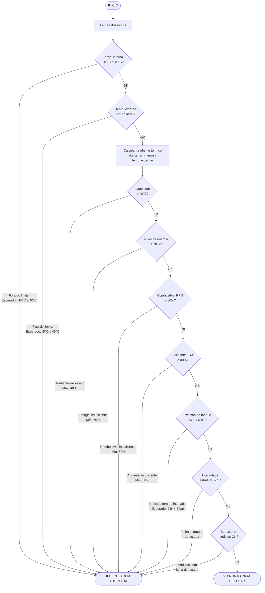

# 🚀 Aurora Siger — Sistema de Verificação de Pré-Decolagem

[](https://www.python.org/)
[](https://ai.google.dev/)
[](https://colab.research.google.com/github/Aurora-Siger/Aurora-Siger-Dev/blob/main/app.py)

Sistema de telemetria e checklist automatizado para a Missão Aurora Siger. Realiza verificações dos parâmetros críticos da nave e decide se o sistema está apto para decolagem.

---

## Algoritmo de Verificação



---

## Parâmetros Verificados

| Parâmetro | Tipo | Faixa Aceitável |
|---|---|---|
| Temperatura interna (eletrônicos) | Input | -10°C a 40°C |
| Temperatura externa (estrutura) | Input | -5°C a 45°C |
| Gradiente térmico | Calculado | ≤ 40°C |
| Nível de energia | Input | ≥ 70% |
| Nível de combustível RP-1 | Input | ≥ 80% |
| Nível de oxidante LOX | Input | ≥ 80% |
| Pressão do tanque | Input | 2.5 a 4.5 bar |
| Integridade estrutural | Input | 1 (OK) |
| Status dos módulos | Calculado | Todos OK |

---

## Análise IA

Após as verificações automáticas, o sistema envia os dados de telemetria para o modelo **Gemini 2.5 Flash** (Google AI), que retorna:

- Classificação de cada parâmetro (normal / atenção / crítico)
- Possíveis anomalias identificadas
- Sugestões de risco

---

## Como executar

### Google Colab

A forma mais rápida de rodar sem instalar nada localmente:

1. Clique no botão abaixo para abrir o notebook no Colab:

   [](https://colab.research.google.com/github/Aurora-Siger/Aurora-Siger-Dev/blob/main/app.py)

2. No Colab, configure sua chave da API Gemini em **Secrets** (ícone de chave 🔑 no painel esquerdo):
   - Nome: `GEMINI_API_KEY`
   - Valor: sua chave obtida em [Google AI Studio](https://aistudio.google.com/app/apikey)

3. Execute as células em ordem.

> **Nota:** No Colab, substitua as chamadas `input()` por variáveis fixas nas células de configuração, já que o ambiente pode não suportar entrada interativa em todos os contextos.

---

### Python local

**Requisitos:** Python 3.x

**Dependências:**

```bash
pip install google-generativeai python-dotenv
```

**Configuração:**

Crie um arquivo `.env` na raiz do projeto com sua chave da API Gemini:

```
GEMINI_API_KEY=sua_chave_aqui
```

**Execução:**

```bash
python app.py
```

O sistema solicitará cada parâmetro via terminal, exibirá o resultado da verificação linha a linha e, ao final, apresentará a análise gerada pela IA.
