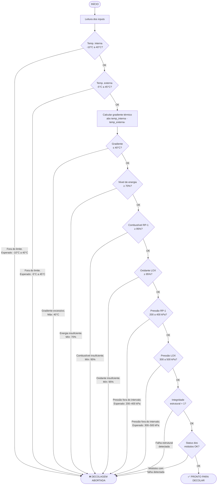

# 🚀 Aurora Siger — Sistema de Verificação de Pré-Decolagem

[](https://www.python.org/)
[](https://ai.google.dev/)
[](https://colab.research.google.com/github/Aurora-Siger/aurora-siger/blob/main/aurora_siger_colab.ipynb)

Sistema de telemetria e checklist automatizado para a Missão Aurora Siger. Realiza verificações dos parâmetros críticos da nave e decide se o sistema está apto para decolagem.

---

## Estrutura do projeto

```
aurora-siger/
├── README.md
├── app.py                          # Sistema de verificação local (Python)
├── aurora_siger_colab.ipynb        # Notebook para Google Colab
├── assets/
│   └── logo_fiap.png
└── docs/
    ├── Análise_Energética.md       # Relatório de Análise Energética e Propulsiva
    ├── ReflexaoCritica.md          # Reflexão Crítica (seção 1.6)
    └── calculos/                   # Cálculos realizados no caderno
        ├── Calculo 1.jpeg          # Equação de Tsiolkovsky - Cenário A
        ├── Calculo 2.jpeg          # Equação de Tsiolkovsky - Cenário B
        ├── Calculo 3.jpeg          # Consumo energético por fase
        ├── Calculo 4.jpeg          # Análise de viabilidade
        ├── Resultado 1.png         # Verificação de massa seca
        ├── Resultado 2.png         # Balanço de energia
        └── Resultado 3.png         # Margem de segurança propulsiva
```

---

## Cálculos do Caderno

Os cálculos realizados manualmente durante a análise da missão encontram-se documentados em [`docs/calculos/`](docs/calculos/). Estes fundamentam o **Relatório de Análise Energética e Propulsiva** disponível em [`docs/Análise_Energética.md`](docs/Análise_Energética.md).

---

## Sobre o projeto


Trabalho desenvolvido para a **Atividade Integradora — Relatório Operacional de Pré-Decolagem** do PBL (Project-Based Learning) da **FIAP**.

**Alunos:**
- Rodrigo Abrantes Mizerani
- Mirela Aparecida Bispo Miguel
- Isabelle Caroline de Camargo Francisco
- Matheus Lyncoln Souza Dias
- Maria Sophia Domingues dos Santos

---

## Algoritmo de Verificação



---

## Parâmetros Verificados

| Parâmetro | Tipo | Faixa Aceitável |
|---|---|---|
| Temperatura interna (eletrônicos) | Input | -10°C a 40°C |
| Temperatura externa (estrutura) | Input | -5°C a 45°C |
| Gradiente térmico | Calculado | ≤ 40°C |
| Nível de energia | Input | ≥ 70% |
| Nível de combustível RP-1 | Input | ≥ 95% |
| Nível de oxidante LOX | Input | ≥ 95% |
| Pressão do tanque de RP-1 | Input | 200 a 400 kPa |
| Pressão do tanque de LOX | Input | 300 a 500 kPa |
| Integridade estrutural | Input | 1 (OK) |
| Status dos módulos | Calculado | Todos OK |

---

## Análise IA

Após as verificações automáticas, o sistema envia os dados de telemetria para o modelo **Gemini 2.5 Flash** (Google AI), que retorna:

- Classificação de cada parâmetro (normal / atenção / crítico)
- Possíveis anomalias identificadas
- Sugestões de risco

---

## Como executar

### Google Colab

A forma mais rápida de rodar sem instalar nada localmente.

**Passo 1 — Obter a chave da API Gemini**

1. Acesse o [Google AI Studio](https://aistudio.google.com/app/apikey) com sua conta Google.
2. Clique em **Create API key** e selecione um projeto Google Cloud (ou crie um novo).
3. Copie a chave gerada (formato: `AIza...`).

**Passo 2 — Configurar o Secrets no Colab**

O Colab possui um cofre de variáveis seguras chamado **Secrets**, que evita expor a chave diretamente no código.

1. No notebook aberto, clique no ícone de chave **🔑** no painel esquerdo (ou vá em **Ferramentas → Secrets**).
2. Clique em **+ Adicionar novo secret**.
3. Preencha exatamente:
   - **Nome:** `GEMINI_API_KEY`
   - **Valor:** cole aqui a chave copiada no passo anterior.
4. Ative o toggle **Acesso ao notebook** para que o código possa ler a chave.

> A chave fica armazenada na sua conta Google e não aparece no código nem é compartilhada se você exportar o notebook.

**Passo 3 — Executar o notebook**

1. Abra o notebook clicando no botão abaixo:

   [](https://colab.research.google.com/github/Aurora-Siger/aurora-siger/blob/main/aurora_siger_colab.ipynb)

2. Execute as células **em ordem**, de cima para baixo (menu **Ambiente de execução → Executar tudo**, ou `Ctrl+F9`).
3. Na célula de inputs, preencha cada valor solicitado e pressione `Enter` para confirmar.

---

### Python local

**Requisitos:** Python 3.x

**Dependências:**

```bash
pip install google-genai python-dotenv
```

**Configuração:**

Crie um arquivo `.env` na raiz do projeto com sua chave da API Gemini:

```
GEMINI_API_KEY=sua_chave_aqui
```

**Execução:**

```bash
python app.py
```

O sistema solicitará cada parâmetro via terminal, exibirá o resultado da verificação linha a linha e, ao final, apresentará a análise gerada pela IA.

---

## Estrutura do Notebook

O notebook [`aurora_siger_colab.ipynb`](aurora_siger_colab.ipynb) está dividido nas seguintes seções:

| Célula | O que faz |
|---|---|
| **1. Instalação** | Instala o SDK `google-genai` diretamente no ambiente Colab com `pip install -q`. Necessário apenas na primeira execução. |
| **2. Configuração do cliente Gemini** | Lê a `GEMINI_API_KEY` do cofre de Secrets do Colab e inicializa o cliente de comunicação com a API Gemini. Se a chave não estiver configurada, esta célula retornará erro. |
| **3. Dados de telemetria** | Solicita os 8 parâmetros de entrada via `input()`. Os valores são armazenados em variáveis para uso nas próximas etapas. |
| **4. Verificação de sistemas** | Valida cada parâmetro contra os limites operacionais definidos no relatório da missão. Exibe o resultado linha a linha com um pequeno delay para simular processamento em tempo real. Ao encontrar a primeira falha, aborta e exibe o motivo. Se todos os sistemas passarem, conclui com ✅ PRONTO PARA DECOLAR. |
| **5. Análise IA — Gemini** | Monta um prompt estruturado com todos os dados de telemetria e envia ao modelo `gemini-2.5-flash`. O modelo retorna uma análise em português classificando cada parâmetro, apontando anomalias e sugerindo riscos. |

---

## Exemplos de Execução

### Passo 1 — Instalação

Instalação das dependências necessárias no ambiente Colab.


---

### Passo 2 — Configuração do Cliente Gemini

Leitura da chave de API do cofre Secrets e inicialização do cliente Gemini.


---

### Passo 3 — Dados de Telemetria

Inserção dos parâmetros de telemetria da nave via `input()`.


---

### Passo 4 — Verificação de Sistemas

Validação sequencial de todos os parâmetros e exibição do resultado linha a linha. A decolagem é autorizada apenas se **todos** os sistemas passarem.


---

### Passo 5 — Análise IA — Gemini

Análise complementar dos dados pela IA, com classificação de parâmetros, identificação de anomalias e sugestões de risco.


---

## Fontes e Referências

Os parâmetros operacionais e os dados energéticos do sistema têm base no **Relatório de Análise Energética e Propulsiva — Missão Aurora Siger (Março de 2026)**, cujos cálculos manualmente realizados encontram-se documentados em [`docs/calculos/`](docs/calculos/). As referências técnicas utilizadas naquele relatório estão listadas abaixo.

| Sistema / Dado | Fonte |
|---|---|
| Isp = 320 s — motor RP-1/LOX | NASA Technical Reports Server — [ntrs.nasa.gov](https://ntrs.nasa.gov) |
| Densidade energética RP-1 — 43,2 MJ/kg | Valor de referência padrão para querosene aeroespacial (RP-1 Lower Heating Value) |
| Flight Computer — 35 W/unidade | AstroForge — Spacecraft Power 101 (Missão Odin) — [astroforge.com](https://astroforge.com/updates-collection/spacecraft-power-101) |
| Telemetria — 5 a 15 W em transmissão ativa | CubeSat Mission and Bus Design Guide — Power Budget and Profiling — [pressbooks-dev.oer.hawaii.edu](https://pressbooks-dev.oer.hawaii.edu/epet302/chapter/5-9-power-budget-and-profiling) |
| IMU e aviônica — arquitetura e consumo | NASA — Small Spacecraft Avionics (SSA) — [nasa.gov](https://nasa.gov/smallsat-institute/sst-soa/small-spacecraft-avionics) |
| Sensores de pressão piezoelétricos ICP® — 2 a 5 W/sensor | PCB Aerospace — Dynamic ICP® Pressure Sensors — [pcb.com](https://pcb.com/Contentstore/mktgcontent/WhitePapers/WPL_2_Low_Dynamic_Pressure.pdf) |
| Termistores NTC qualificados NASA — 0,5 a 2 W/sensor | TE Connectivity — Sensors in Space (Missões Juno e Pioneer 10) — [te.com](https://te.com/en/whitepapers/sensors/sensors-in-space.html) |
| Sensores de nível de propelente — Collins Aerospace | Collins Aerospace — Space Sensors (SLS/Artemis) — [collinsaerospace.com](https://collinsaerospace.com/what-we-do/industries/space/space-sensors) |
| Sensores de temperatura, pressão e controle vetorial | DwyerOmega — How Sensors Play a Role in Spaceflight — [dwyeromega.com](https://dwyeromega.com/en-us/resources/sensors-role-in-spaceflight) |
| ECUs com protocolo CAN Bus aeroespacial | CubeSat Avionics Guide — [pressbooks-dev.oer.hawaii.edu](https://pressbooks-dev.oer.hawaii.edu/epet302/chapter/6-4) |

